# Vehicle Detection

The goal of this project is to be able to detect cars in a video stream. This consists of the following steps

1. Train the Classifier on HOG & Color Features 
2. Implement Pipleline for detection 
3. Removing Duplicates and False Positives


## Step 1: Train the Classifier on HOG Features

A sample of the non car images.

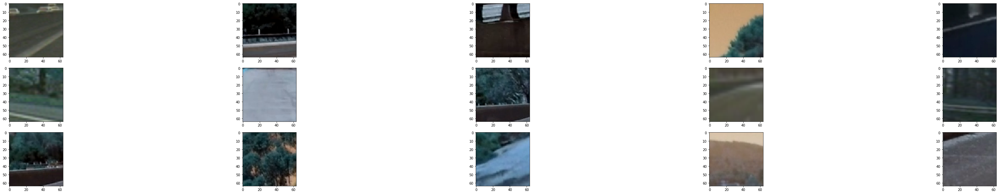

A sample of the car images.

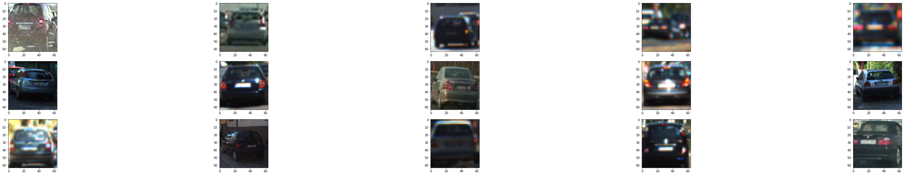
### Extracing HOG decriptor from image. 
An example of HOG extraction for an image from the training set

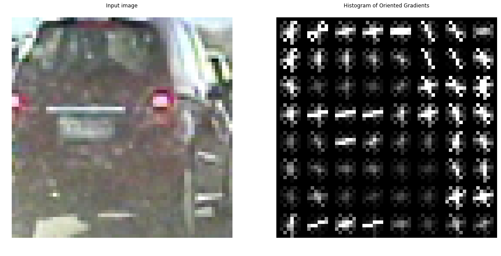

The function "extract_features" was user to extract the features. The number of orientations for HOG was varied as 9,18,36 with 36 chosen based on greater accuracy of the SVM classifier. 

Next, I integrated the color histrogram feature and spatial color features into the feature extraction process. 

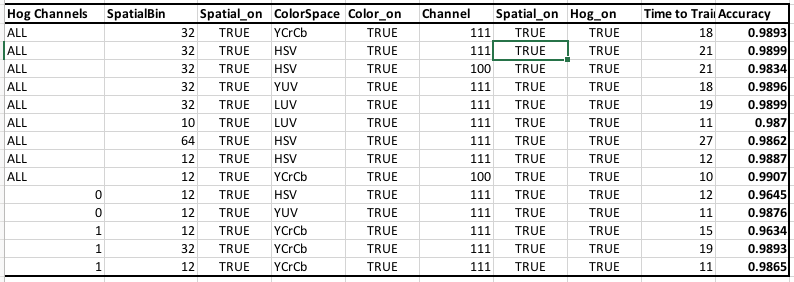

Initial, optimal results (99.07% accuracy) were obtained by using the YCrCb colorspace for the color histogram features and spatial color binning feature. However, later after applying the classifier to the pipeline it was found that spatial color binning features were actually reducing the accuracy of vehicle detection. So the spatial color binning features were dropped and a combination of hog with Y channel (of YCrCb) based color histogram feature was used.


```python
def extract_features(image,color_channel=[0,0,0],spatial_on=True, spatial_size = (32,32),hog_on = True,hog_channel = 'ALL',color_space ='RGB'):
    #
    features =[]
    
    if color_space != 'RGB':
        if color_space == 'HSV':
            feature_image = cv2.cvtColor(image, cv2.COLOR_RGB2HSV)
        elif color_space == 'LUV':
            feature_image = cv2.cvtColor(image, cv2.COLOR_RGB2LUV)
        elif color_space == 'HLS':
            feature_image = cv2.cvtColor(image, cv2.COLOR_RGB2HLS)
        elif color_space == 'YUV':
            feature_image = cv2.cvtColor(image, cv2.COLOR_RGB2YUV)
        elif color_space == 'YCrCb':
            feature_image = cv2.cvtColor(image, cv2.COLOR_RGB2YCrCb)
    else: feature_image = np.copy(image)             
        
    spatial_features = cv2.resize(feature_image, spatial_size).ravel()
    
    hist1,_ = np.histogram(feature_image[:,:,0], bins = 32, range=(0,256))
    hist2,_ = np.histogram(feature_image[:,:,1], bins = 32, range=(0,256))
    hist3,_ = np.histogram(feature_image[:,:,2], bins = 32, range=(0,256))
    
    hist_features = []
    
    if(color_channel[0]):
        hist_features = np.concatenate((hist_features,hist1))
    if(color_channel[1]):
        hist_features = np.concatenate((hist_features,hist2))
    if(color_channel[2]):
        hist_features = np.concatenate((hist_features,hist3))
    
    
    hog_features = []
    if(hog_channel=='ALL'):
        image_gray = bgr2gray(image)
        hog_features = HOG.compute(image_gray)
        hog_features = np.ravel(hog_features)
    else:
        if(hog_channel ==0):
            hog_features_c1 = HOG.compute(feature_image[:,:,0])
            hog_features_c1 = np.ravel(hog_features_c1)
            hog_features = np.concatenate((hog_features,hog_features_c1))
        if(hog_channel ==1):
            hog_features_c2 = HOG.compute(feature_image[:,:,1])
            hog_features_c2= np.ravel(hog_features_c2)
            hog_features = np.concatenate((hog_features,hog_features_c2))
        if(hog_channel ==2):
            hog_features_c3 = HOG.compute(feature_image[:,:,2])
            hog_features_c3= np.ravel(hog_features_c3)
            hog_features = np.concatenate((hog_features,hog_features_c3))
    
    features  = hist_features
    if(spatial_on):
        features = np.concatenate((features,spatial_features))
    if(hog_on):
        features = np.concatenate((features,hog_features))
    return features
```


### Split Training and Test Data sets.

The features were scaled using the traning set. A plot of the combined and scaled features is shown in the figure below.

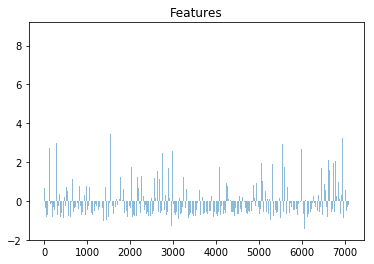

### Train a classifier 

```python
svc = svm.LinearSVC()
t_1 = time.time()
svc.fit(X_train,y_train)
t_2 = time.time()
print('Time to train =', round(t_2-t_1), ' seconds')
print('Accuracy of SVC = ', round(svc.score(X_test,y_test),4))
```

    Time to train = 32  seconds
    Accuracy of SVC =  0.9724

## Step 2 Implement Pipleline for detection 
### A multiscale sliding windows were used to detect the features. Window sizes included 
(50,50),(64,64),(75,75),(100,100) and (125,125). The windows were scaled based on distance from
the camera. Further areas used smaller windows. The overlap was obtained through trial and error. 


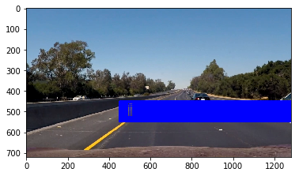

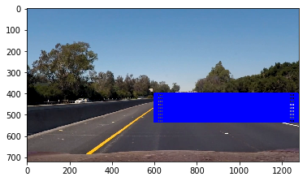

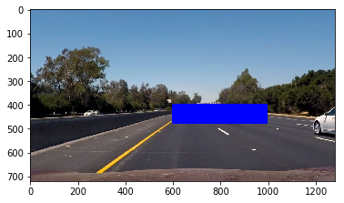

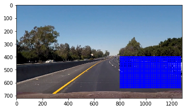

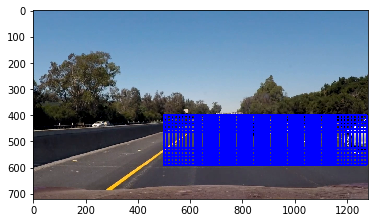

Combined plot of the scanned windows is as follows.

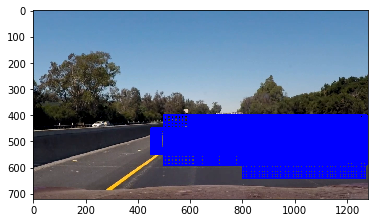


```python
def get_roi(window,frame):
    (x1,y1),(x2,y2) = window
    roi = frame[y1:y2,x1:x2]
    return roi
    

```


```python
#frame = sample_car[1]
def predict_car_vs_non_car(image):
    img64x64 = cv2.resize(image,winSize)
    features_pred = extract_features(img64x64,color_channel,spatial_on, spatial_size ,hog_on,hog_channel,color_space ) 
    scaled_features = X_scaler.transform(features_pred.reshape(1, -1))
    y_predict = svc.predict(scaled_features.reshape(1, -1)) 
    return y_predict
```


```python
def find_cars(frame):
    input_rois = [get_roi(window,frame) for window in windows]
    prediction_for_rois = [predict_car_vs_non_car(image) for image in input_rois]
    indices_arr = np.array(prediction_for_rois).astype(np.bool)
    indices = np.ndarray.flatten(indices_arr)
    idx = np.where(indices)[0]
    hot_windows  = [windows[i] for i in idx]
    return hot_windows
```


Some examples of frames with detection. Notice the false positives. 

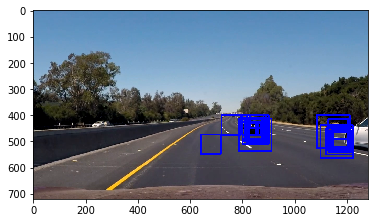
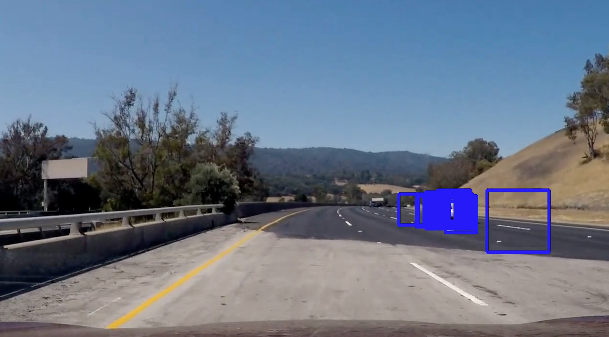


## Step 3: Removing Duplicates and False Positives.
The false positives in each frame were removed by applying heat and thresholding the images.
```python
def add_heat(windows,frame):
    mask = np.zeros_like(frame[:,:,0])
    for (x1,y1),(x2,y2) in windows:
        mask[y1:y2,x1:x2]+=1
    return mask
        

```


```python
def apply_threshold(threshold, heat_map):
    heat_map[heat_map <= threshold] = 0
    return heat_map
    
```


#### Frame with heat applied 
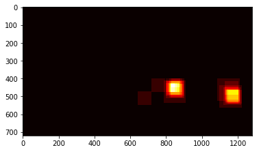
#### Frame after thresholding
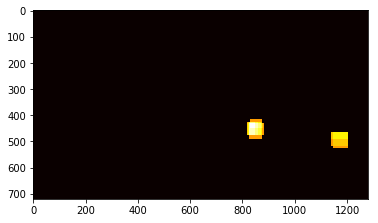


#### Final detections
```python
labels = label(heat_image_thresholded)
print(labels[1], 'cars found')
plt.imshow(labels[0], cmap='gray')
plt.show()
```
    2 cars found

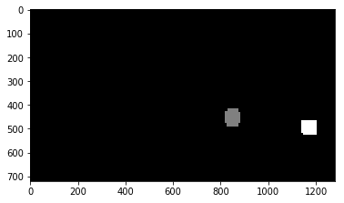


The filtering within the frame was done using find_cars_with_heat_threshold() function. 
Elongated and tiny bounding boxes were also filtered. 

```python
def find_cars_with_heat_threshold(frame):
    hot_windows  = find_cars(frame)
    heat_image = add_heat(hot_windows,frame)
    threshold = 8
    heat_image_thresholded = apply_threshold(threshold, heat_image)
    labels = label(heat_image_thresholded)
    bounding_boxes = []
    for car_number in range(1, labels[1]+1):
        nonzero = (labels[0] == car_number).nonzero()
        nonzeroy = np.array(nonzero[0])
        nonzerox = np.array(nonzero[1])
        bbox = ((np.min(nonzerox), np.min(nonzeroy)), (np.max(nonzerox), np.max(nonzeroy)))
        (x1,y1),(x2,y2) = bbox
        if(x2 > x1) and (y2 > y1): 
            if(x2-x1)>5 and (y2-y1)>5: # remove tiny boxes
                if ((x2-x1)/(y2-y1))<3 and ((y2-y1)/(x2-x1))<3: # remove elongated bbox 
                    bounding_boxes.append(bbox)
    return bounding_boxes
                    
```

The output improved greatly after the single frame thresholding. 

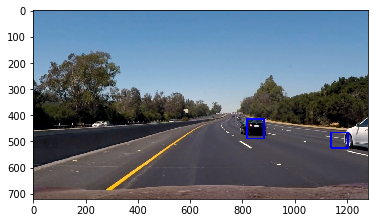


### Filtering using time window . 
However, there were still some false positives that appear in the video. A way to eliminate the
spurious detections was to apply a time window based thresholding. In my implementation I used a 20 last windows and applied heat threshold of 12. 


### Discussion 
* The color histogram features were dropped in the final implementation. Purely structural features like Y channel of YCrCb and HOG were good enough to detect cars. Augmenting the training data with color variations of cars would improve the accuracy in using color histrograms.
* The pipeline will fail where faster execution is needed. The feature extraction over multiple windows can be further optimized.
* The pipeline is likely to fail in cases where there are rapid lane changes since the thresholding applied is spatial. Some form of advanced tracking using the centroid and direction of movement of the vehicle should mitigate that problem. 

